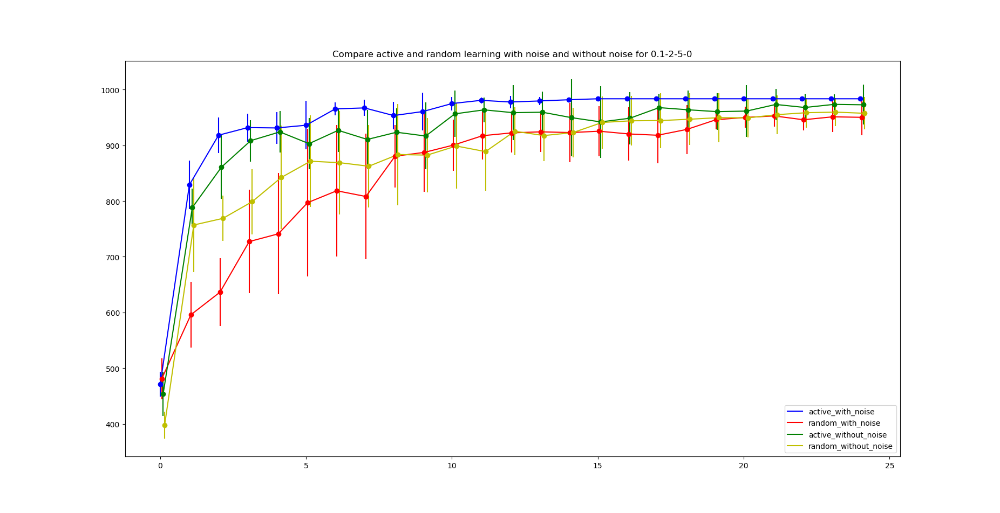
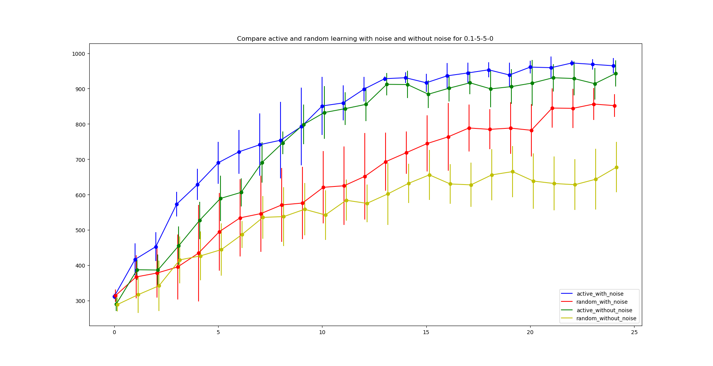
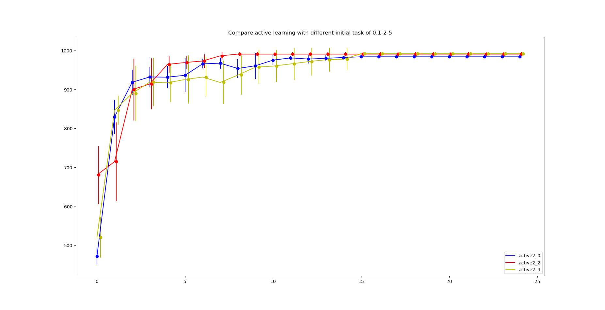
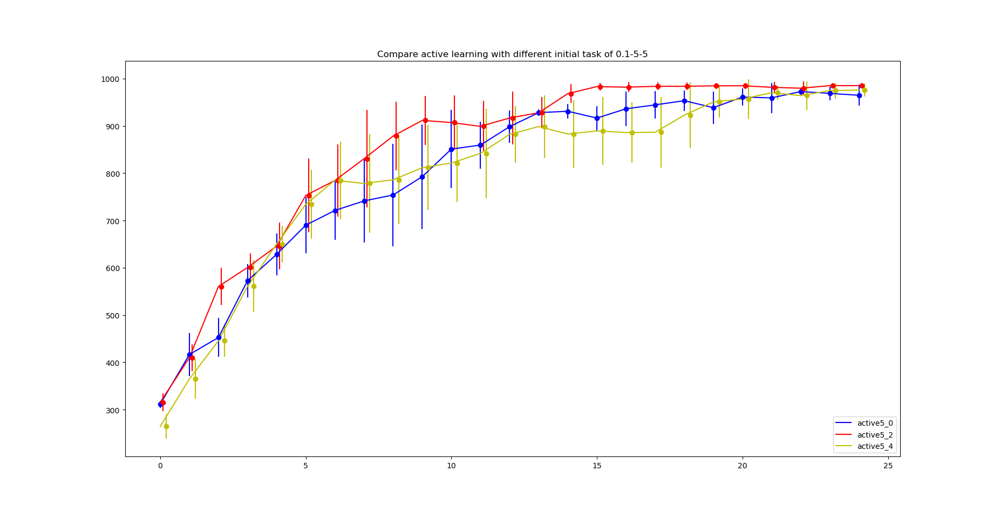
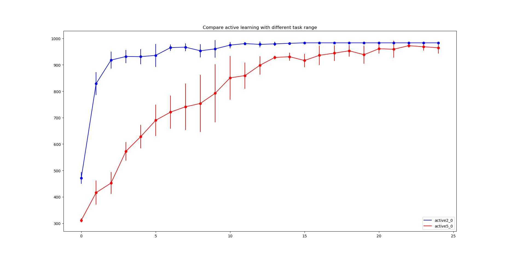
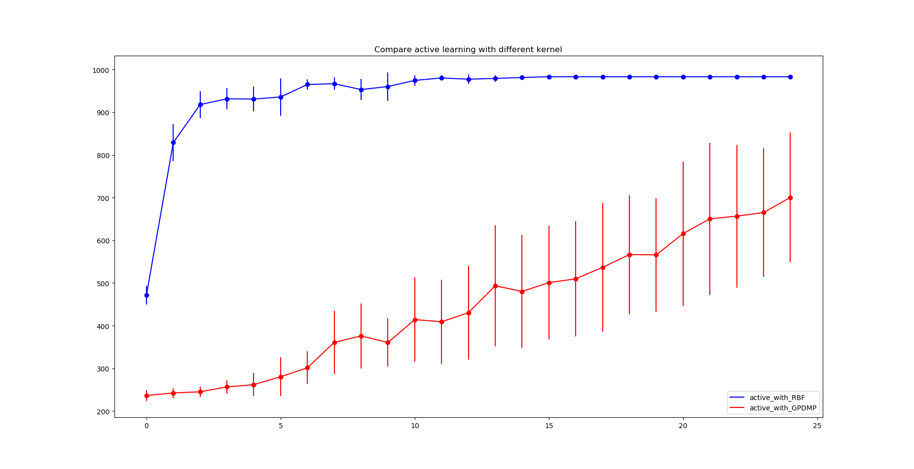

# Active Learner

Active Learner is to automatically learn optimal policies for a set of task parameters.
During the learning process, Active Learner will always select the most promising task
parameter which maximizes performance improvement over entire task set.

- Original paper: http://irobotics.aalto.fi/pdfs/active_incremental_learning.pdf
## Installation
Active Learner requires python3 (>=3.5) 

Required Python packages:
- `Stabe-Baselines` https://stable-baselines.readthedocs.io/en/master/guide/install.html
- `gym` https://github.com/openai/gym/blob/master/README.rst
- `numpy`
- `scikit-learn`

Note: Stabe-Baselines supports Tensorflow versions from 1.8.0 to 1.14.0. Support for Tensorflow 2 API is planned.

### Install using pip
- `pip install .`

## Example
Here is a quick example of how to run ActiveLearner on a cartpole environment:
```python
from active_learner.al import ActiveLearner
from stable_baselines import PPO2
from stable_baselines.common.policies import MlpPolicy
import gym
from sklearn.gaussian_process.kernels import RBF
import gym_al
path = "/home/username/active_learner_model/"
model = ActiveLearner(id_num=5, task_param_name='masspole', task_min=0.1, task_max=5, algorithm=PPO2,
                      nminibatches=4, max_reward=200, reward_threshold=190, policy=MlpPolicy,
                      policy_kwargs={'net_arch': [dict(pi=[32, 32])]}, need_vec_env=True)

# contextual environments
task_params = model.get_task_params()
env = []
for i in task_params:
    env.append(gym.make('CartPoleAl-v2', masspole=i))

# active learning process
model.run(env=env, init_task_index=0, sm_kernel=RBF(1, (1, 1)), rm_kernel=RBF(1, (1, 1)), path=path+"1/", 
          init_learning_timesteps=50000, learning_interval=10000, noise_coef=0.01)
```
## ActiveLearner Parameters
```
class active_learner.al.ActiveLearner(id_num, task_param_name, task_min, task_max, algorithm, policy, nminibatches, max_reward,
                 reward_threshold, policy_kwargs=None, need_vec_env=False)
```

## Gym_al
Gym_al is a cartpole environment based on gym. We register a new cartpole environment "CartPoleAl-v2" which
you can define your own environment with different pole masses by
```
gym.make('CartPoleAl-v2', masspole=i)
```
Remember import gym_al at the beginning.
Active Learner algorithm need a contextual environment list, thus you can define the environment by
```
task_params = model.get_task_params()
env = []
for i in task_params:
    env.append(gym.make('CartPoleAl-v2', masspole=i))
```

## Results


| #     | Figure   |  Description   |
| :------------- | :-------------: | -------------: |
| 1 |  | Compare active and random learning with noise and without noise for 0.1-2-5-0 |
| 2 |  | Compare active and random learning with noise and without noise for 0.1-5-5-0 |
| 3 |  | Compare active learning with different initial task of 0.1-2-5 |
| 4 |  | Compare active learning with different initial task of 0.1-5-5 |
| 5 |  | Compare active learning with different task range |
| 6 |  | Compare active learning with different kernel |
| 7 |  | Compare learning rate model with different task parameters |

The difference in skill performance is more significant when we update the skill with noise for task-0.1-2-5-0
From figure 1 and 2, we found a more significant difference in SP when task range increases.
From figure 3 and 4,
- similar performance
- starting from middle task have slightly better SP
- if starting from last task is more difficult, it is not a good idea to start learning with it
From figure 5, we found that we can learn faster when task range is small.
From figure 6, we found the local model is better for this task.
## Citing the Project
