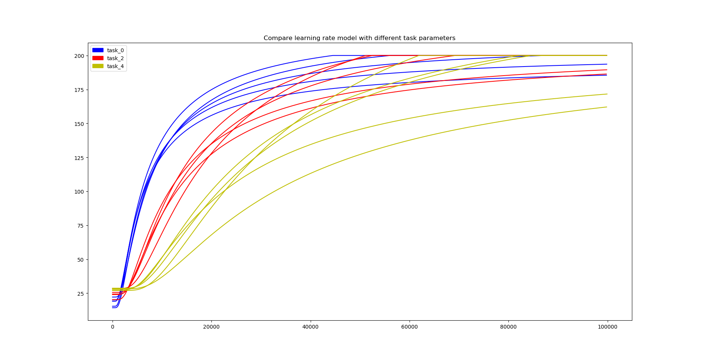

# Active Learner

Active Learner is to automatically learn optimal policies for a set of task parameters.
During the learning process, Active Learner will always select the most promising task
parameter which maximizes performance improvement over entire task set.

- Original paper: http://irobotics.aalto.fi/pdfs/active_incremental_learning.pdf
## Installation
Active Learner requires python3 (>=3.5) 

Required Python packages:
- `Stabe-Baselines` https://stable-baselines.readthedocs.io/en/master/guide/install.html
- `gym` https://github.com/openai/gym/blob/master/README.rst
- `numpy`
- `scikit-learn`
- `tensorflow` 

Note: Stabe-Baselines supports Tensorflow versions from 1.8.0 to 1.14.0. 
You can install it with `pip install tensorflow==1.14.0`

### Install using pip
- `pip install .`

## Example
Here is a quick example of how to run ActiveLearner on CartPoleAl-v2:
```python
import gym
from active_learner.al import ActiveLearner
from stable_baselines import PPO2
from stable_baselines.common.policies import MlpPolicy
from sklearn.gaussian_process.kernels import RBF
import gym_al

model = ActiveLearner(id_num=5, task_param_name='masspole', task_min=0.1, task_max=5, algorithm=PPO2,
                      max_reward=200, reward_threshold=190, policy=MlpPolicy,
                      policy_kwargs={'net_arch': [dict(pi=[32, 32])]}, need_vec_env=True)

# contextual environments
task_params = model.get_task_params()
env = []
for i in task_params:
    env.append(gym.make('CartPoleAl-v2', masspole=i))

# active learning process
path = "/home/username/model/"
model.run(env=env, init_task_index=0, sm_kernel=RBF(1, (1, 1)), rm_kernel=RBF(1, (1, 1)), path=path, 
          init_learning_timesteps=50000, learning_interval=10000, noise_coef=0.01)
```

You also can run the test_al.py file with command `python3 test_al.py [path]`.

The learned model will be saved in `[path]`.

For example, run with `python3 test_al.py /home/yourusername/model/` (Don't forget to add '/' at the end).

## ActiveLearner Parameters

```
class active_learner.al.ActiveLearner(id_num, task_param_name, task_min, task_max, algorithm, policy, max_reward,
                 reward_threshold, policy_kwargs=None, need_vec_env=False)
```
### Parameters
- id_num: (int) The total number of tasks
- task_param_name: (str) The name of the task variable
- task_min: (float) The minimum task parameter
- task_max: (float) The maximum task parameter
- algorithm: (RLModel or str) The RL model to use (PPO2, DDPG, ...)
- policy: (Policy or str) The policy model to use (MlpPolicy, CnnPolicy, ...)
- max_reward: (int) The maximum reward that an episode can consist of
- reward_threshold: (float) The reward threshold before all the tasks are considered solved
- policy_kwargs: (dict) additional arguments to be passed to the policy on creation
- need_vec_env: (bool) Whether or not to use a vectorized environment

```
run(env, init_task_index, sm_kernel, rm_kernel, path, init_learning_timesteps, learning_interval, noise_coef)
```
### Parameters
- env: (list) Contextual environment
- init_task_index: (int)
- sm_kernel: (kernel object) The Gaussian Process Regression kernel of contextual skill model
- rm_kernel: (kernel object) The Gaussian Process Regression kernel of reward model
- path: (str) The saved path of the learned model
- init_learning_timesteps: (int) The total initial time steps for training the initial task
- learning_interval: (int) The time steps interval for training a task
- noise_coef: (float) The coefficient of noise when evaluating the learned policy

## Important hyper-parameters
- initial guess for the learning rate function
- max reward and reward thershold: run for the initial task, and observe the best acheivable reward; then select the max reward to be bigger than the best acheivable reward
- reward model and skill model kernel parameters (RBF(a,(b,c)) in our case, a,b,c=1)
https://scikit-learn.org/stable/modules/generated/sklearn.gaussian_process.kernels.RBF.html#sklearn.gaussian_process.kernels.RBF

## Gym_al
Gym_al is the active learning environment based on gym, including cartpole, pendulum and mountaincar. For example, we register a new cartpole environment "CartPoleAl-v2" and
you can define your own environment with different pole masses by
```
gym.make('CartPoleAl-v2', masspole=i)
```
Remember import gym_al at the beginning.
Active Learner algorithm need a contextual environment list, thus you can define the environment by
```
task_params = model.get_task_params()
env = []
for i in task_params:
    env.append(gym.make('CartPoleAl-v2', masspole=i))
```

## Results

Here is the result in cartpole environment.

| #     | Figure   |  Description   |
| :------------- | :------------- | :------------- |
| 1 |  | Compare active and random learning with noise and without noise for 0.1-2-5-0 |
| 2 |  | Compare active and random learning with noise and without noise for 0.1-5-5-0 |
| | The difference in skill performance is more significant when we update the skill with noise for task-0.1-2-5-0<br>In figure 1 and 2, we found a more significant difference in SP when task range increases.|
| 3 |  | Compare active learning with different initial task of 0.1-2-5 |
| 4 |  | Compare active learning with different initial task of 0.1-5-5 |
| | In figure 3 and 4,<br>- similar performance<br>- starting from middle task have slightly better SP<br>- if starting from the task 4 is more difficult, it is not a good idea to start learning with it|
| 5 |  | Compare active learning with different task range |
| | In figure 5, we found that we can learn faster when task range is small|
| 6 |  | Compare active learning with different kernel |
| | In figure 6, we found the local model is better than a global model|
| 7 |  | Compare learning rate model with different task parameters |
| | In figure 7, we compared learning rate model with masspole 0.1, 2.55, 5, and we found masspole 0.1 has the fastest learning rate |


## Citing the Project
```
@misc{active-learner,
  author = {Li, Xiaopu and Hazara, Murtaza and Kyrki Ville},
  title = {Active Learner},
  year = {2019},
  publisher = {GitHub},
  journal = {GitHub repository},
  howpublished = {\url{https://github.com/lixiaopu/active_learner}},
}
```

